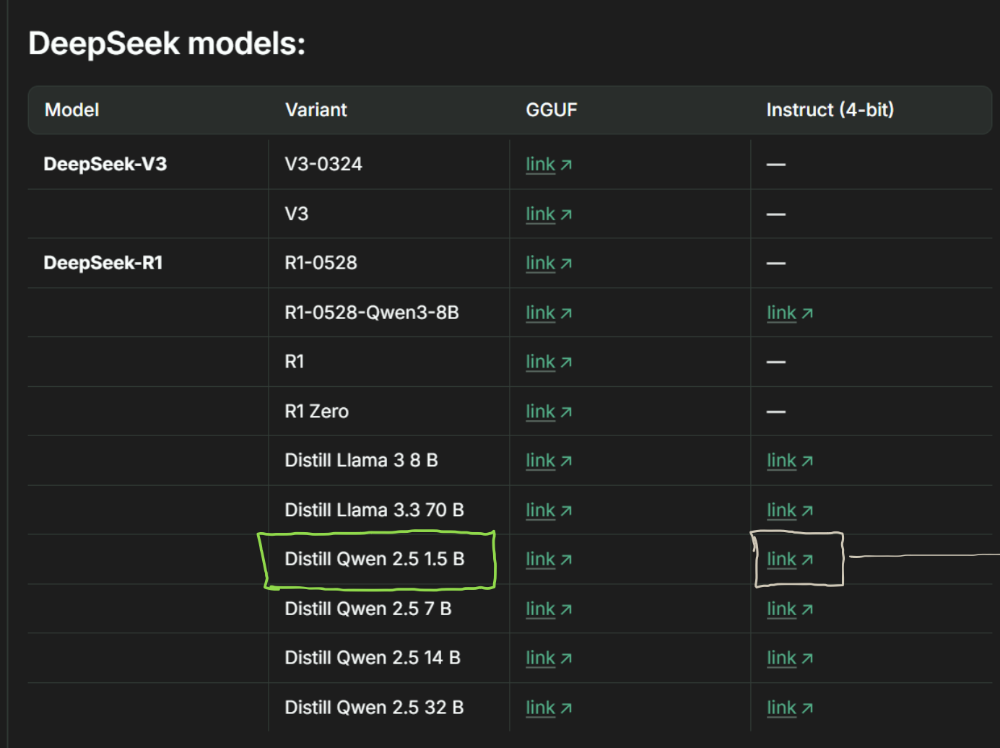
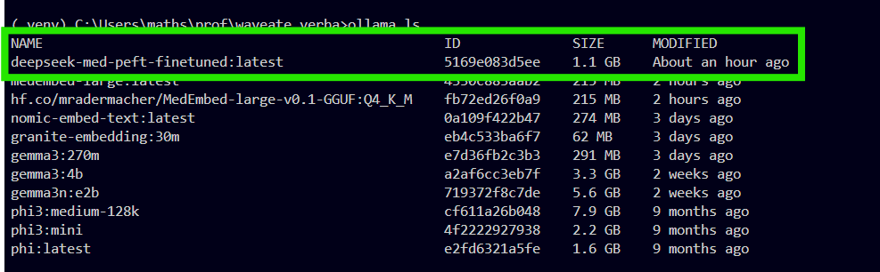

# Med LLM Finetune

## Chosen Model
DeepSeek R1 - Distill Qwen 2.5 1.5 B

### Reason & future
Smaller in size and faster, quicker to finetune.
Later this model can be **used as a smaller model in speculative decoding**.
bigger evaluation model in speculative decoding can be built later.



### Fine-tune method of choice
1. PEFT
   - LoRA
#### Reason
Widely adapted for Domain adaptation like in this application.
without catestropic forgetting.

for training results, refer attached tuning notebook

Fine tuning notebook: https://colab.research.google.com/drive/1ROeLbyxmU9WlvjHVzvI-RjHeTC5elZBq?usp=sharing

## RAG Model (hf.co/mradermacher/MedEmbed-large-v0.1-GGUF:Q4_K_M) 
specifically finetuned for Medical applications
hf.co/mradermacher/MedEmbed-large-v0.1-GGUF:Q4_K_M

### Rag model hosting
RAG model is hosted locally using ollama,
Since this specific embedding model is not available in the ollama, downloaded using modelfile below
```
FROM hf.co/mradermacher/MedEmbed-large-v0.1-GGUF:Q4_K_M
```
RAG chunking, embedding and upserting: file
```
.\rag\save_waveate.ipynb
```
## Hosting
self hosted in local.
- localmachine -> VPN -> Domain

### Steps followed:
1. Fine-tuned model is downloaded to local in .gguf format
2. Modelfile is created for ollama for downloaded model
3. Install the model in ollama using the model file.

