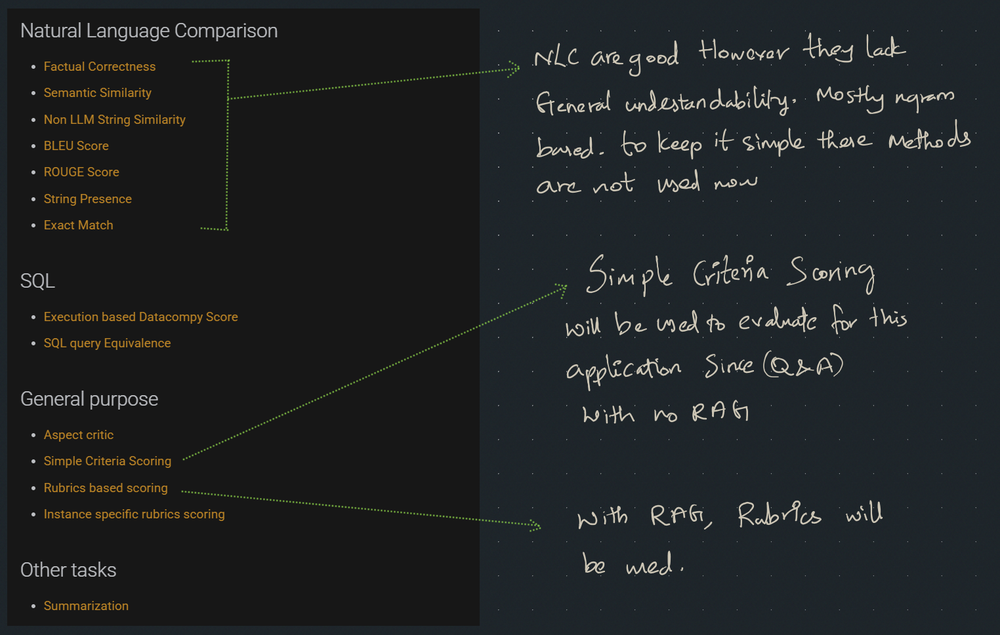

# Med LLM Finetune

## Chosen Model
DeepSeek R1 - Distill Qwen 2.5 1.5 B

### Reason & future
Smaller in size and faster, quicker to finetune.
Later this model can be **used as a smaller model in speculative decoding**.
bigger evaluation model in speculative decoding can be built later.


### Fine-tune method of choice
1. PEFT
   - LoRA
#### Reason
Widely adapted for Domain adaptation like in this application.
without catestropic forgetting.

for training results, refer attached tuning notebook

Fine tuning notebook: https://colab.research.google.com/drive/1ROeLbyxmU9WlvjHVzvI-RjHeTC5elZBq?usp=sharing

## RAG Model (hf.co/mradermacher/MedEmbed-large-v0.1-GGUF:Q4_K_M) 
specifically finetuned for Medical applications
hf.co/mradermacher/MedEmbed-large-v0.1-GGUF:Q4_K_M

### Rag model hosting
RAG model is hosted locally using ollama,
Since this specific embedding model is not available in the ollama, downloaded using modelfile below
```
FROM hf.co/mradermacher/MedEmbed-large-v0.1-GGUF:Q4_K_M
```
RAG chunking, embedding and upserting: file
```
.\rag\save_waveate.ipynb
```
## Hosting
self hosted in local.
- localmachine -> VPN -> Domain

### Steps followed:
1. Fine-tuned model is downloaded to local in .gguf format
2. Modelfile is created for ollama for downloaded model
3. Install the model in ollama using the model file.


### Previewing in verba


## Deployment in Fast API
Process:
1. User query rewriting for better retreival
2. Search for top K in vector DB
3. Provide the relevant answer


## Testing Suit
eval method of choice
1. Simple Criteria Scoring
2. Rubrics based Scoring

N-gram based scoring will be done later
namely,
1. ROUGE
2. BLEU

Semantic scoring - yet to be explored by me
3. Semantic similarity



## Cmd to run the Fast API app
```
uvicorn main:app --host 0.0.0.0 --port 9900 --access-log
```

## cmd to prepare evaluation data given the test data
```
python ragas_eval_data_preparation.py --in .\test_data\test.jsonl --out eval.jsonl --endpoint https://medproxy.vldo.in/search --
concurrency 8 --max_retries 3
```

# Rubrics based Scoring

gemma3:4b is used to evaluate the finetuned model

## run evaluation 
```
python custom_eval.py --in eval.jsonl --out eval_scores_context.csv --model gemma3:4b --temperature 0.1
```

## Evaluation result (DeepSeek R1 - Distill Qwen 2.5 1.5 B - No RAG)
# Average Score 4.04 out of 5

Scoring rubric (0..5, 5 is best):
  - 5: Semantically matches ground truth (or strictly better & consistent with contexts)
  - 4: Mostly correct & grounded; minor issues
  - 3: Partially correct; notable gaps; weak grounding
  - 2: Largely incorrect or ungrounded; contradictions
  - 1: Mostly wrong or ungrounded
  - 0: Completely wrong/irrelevant

### Mode: 5

Evaluation model's (reason vs score plot)


## Evaluation result (DeepSeek R1 - Distill Qwen 2.5 1.5 B - With RAG)
# Average Score 3.4 out of 5

The finetuned model scored less with RAG context most probably because of over prompting cauing Hallucination.
More - Context Engineering is requeries to make the RAG work with the finetuned PEFT model.

Evaluation model's (reason vs score plot)

